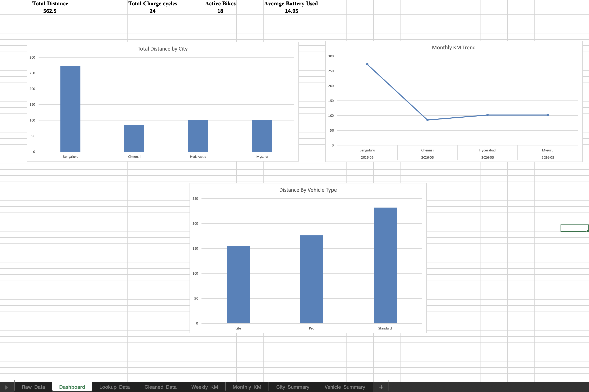
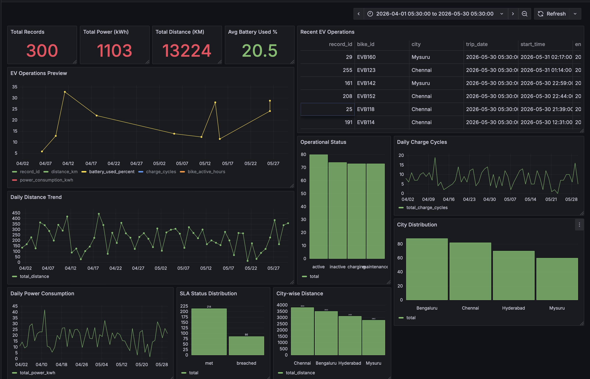

# Excel Reporting Dashboard Automation

An Excel automation project that generates EV fleet reporting workbooks with weekly and monthly summaries, city and vehicle-level analysis, formatted sheets, and an Excel dashboard for KPI tracking and reporting.

## Overview

This project automates EV fleet reporting using Python and Excel. It reads operational data, merges lookup data, generates weekly and monthly summaries, and exports a formatted multi-sheet Excel workbook for reporting and dashboard analysis.

## Features

- Automated Excel report generation using Python
- Multi-sheet workbook creation
- Weekly KM summary
- Monthly KM summary
- City-level summary
- Vehicle-type summary
- Excel formatting with styled headers, freeze panes, and adjusted column widths
- Dashboard sheet with KPI cards and charts
- Reusable reporting workflow for EV operations teams

## Tech Stack

- Python
- Pandas
- openpyxl
- XlsxWriter
- Microsoft Excel
- Grafana
- PostgreSQL

## Project Structure

```text
excel-reporting-dashboard-automation/
├── assets/
│   ├── dashboard.png
│   └── grafana-dashboard.png
├── data/
├── docs/
├── output/
├── create_excel_report.py
├── format_excel_report.py
├── requirements.txt
└── README.md
```

## Workflow

1. Load EV operations data and lookup data.
2. Clean and merge the datasets.
3. Generate weekly and monthly summaries.
4. Export results to a multi-sheet Excel workbook.
5. Apply workbook formatting using openpyxl.
6. Build a dashboard sheet in Excel with KPI cards and charts.
7. Extend reporting into Grafana for interactive analytics and filtering.

## Output Sheets

The generated workbook contains the following sheets:

- `Raw_Data`
- `Lookup_Data`
- `Cleaned_Data`
- `Weekly_KM`
- `Monthly_KM`
- `City_Summary`
- `Vehicle_Summary`
- `Dashboard`

## Project Screenshots

### Excel Dashboard


### Grafana Dashboard


## Business Use Case

This project simulates a reporting workflow for EV operations teams that need reliable weekly and monthly reporting for distance traveled, battery usage, charge cycles, and city-level fleet monitoring. It is useful for internal reporting, operational reviews, and dashboard-based analysis.

## How to Run

### 1. Create and activate a virtual environment

```bash
python3 -m venv venv
source venv/bin/activate
```

### 2. Install dependencies

```bash
pip install -r requirements.txt
```

### 3. Generate the Excel report

```bash
python3 create_excel_report.py
python3 format_excel_report.py
```

## Grafana Extension

The reporting workflow was extended into Grafana by loading EV operations data into PostgreSQL and creating an interactive dashboard with:

- KPI cards
- Daily trend charts
- City-level analysis
- SLA and operational status tracking
- Filters for city and bike type

This shows how the same reporting pipeline can support both Excel-based business reporting and dashboard-based monitoring.

## Resume Bullet

Built an Excel Reporting Dashboard Automation project using Python, Pandas, openpyxl, and XlsxWriter to generate multi-sheet operational reports and KPI-based Excel dashboards for EV fleet monitoring, later extending the reporting workflow into Grafana for interactive analytics.

## Project Highlights

- Automated repetitive reporting work with Python
- Created clean, presentation-ready Excel outputs
- Combined data processing, Excel reporting, and dashboard-oriented analytics in one workflow
- Designed a business-focused reporting solution for EV fleet operations
- Extended static Excel reporting into interactive Grafana monitoring

## Future Improvements

- Add slicers and pivot charts
- Add conditional formatting for KPI alerts
- Export charts automatically from Python
- Extend the reporting workflow to Power BI
- Add Docker-based deployment for PostgreSQL and Grafana
- Add automated screenshot generation and sample output files for portfolio demos
